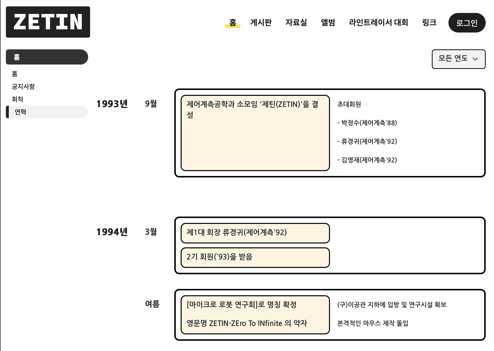

# ZETIN Milestone

[ZETIN 연혁 페이지](https://zetin.uos.ac.kr/index.php?mid=history) 입니다.



## 새로운 연도 정보 추가하기

### 1. 본 레포지토리의 ./src/Milestone/data 로 이동

### 2. {원하는 연도}.json 파일을 추가

- 형식은 다음과 같으며, 원하는 월/행사 등을 추가해서 사용하면 됩니다.

```json
{
  "year": "20NN년",
  "items": [
    {
      "month": "1월",
      "infoes": [
        {
          "titles": ["행사1"],
          "texts": ["행사 내용1", "행사 내용2"]
        },
        {
          "titles": ["행사2"],
          "texts": []
        }
      ]
    },
    {
      "month": "2월",
      "infoes": [
        {
          "titles": ["행사1"],
          "texts": ["행사 내용1", "행사 내용2"]
        }
      ]
    }
  ]
}
```

### 3. index.json 수정

- dataFileNames 리스트에 "{원하는 연도}.json" 추가

### 4. 파일 추가 후, 정상작동하는지 테스트

- npm start로 작동 테스트

## Available Scripts

In the project directory, you can run:

### `npm start`

Runs the app in the development mode.\
Open [http://localhost:3000](http://localhost:3000) to view it in your browser.

The page will reload when you make changes.\
You may also see any lint errors in the console.

### `npm run build`

Builds the app for production to the `build` folder.\
It correctly bundles React in production mode and optimizes the build for the best performance.

The build is minified and the filenames include the hashes.\
Your app is ready to be deployed!

See the section about [deployment](https://facebook.github.io/create-react-app/docs/deployment) for more information.
